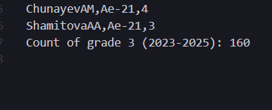

# -------------------- 1 часть -----------------
# ----------------- Создание csv отчета ----------
cat TEST-1 TEST-2 TEST-3 TEST-4 \
| grep "2025" \
| sed '/;[0-2]$/d' \
| sed 's/\([^;]*\);\([^;]*\);\([^;]*\);\([^;]*\);\([^;]*\)$/\2;\1;\5/' \
| sed 's/;/,/g' \
| sed 's/-22//g' \
> report_2025.csv

### объединяем содержимое четырёх файлов и отдаём его дальше по конвейеру,
### оставляем только строки, содержащие последовательность символов 2025
### sed в форме /PATTERN/d удаляет строки, которые соответствуют PATTERN.
### PATTERN ;[0-2]$ означает: символ ;, затем одна цифра из диапазона 0, 1, 2, и конец строки
### Шаблон описывает строку из пяти полей, разделённых символом ;, и захватывает их в группы
###     s/ substitue - замена
###     в базовом sed нужно экранировать скобки \( и \)
###     [^;]* любой символ кроме ; ноль или более раз, и заканчивается группа ;
###     /\2;\1;\5/ вставляется содержимое 2, 1 и 5 групп через ;
### Заменяет все ; на , в строке (g — глобально)
### Удаляет все вхождения буквосочетания -22 в строке
### Перенаправляеv результат в файл report_2025.csv

# ------------------ Добавление итоговой строки ------------------
echo "Count of grade 3 (2023-2025): $(cat TEST-* | grep -E '202(3|4|5)' | grep -E ';3$' | wc -l)" >> report_2025.csv

### Создаём строку, в которую вставляется результат вычислений из подкоманды $( ... ), и добавляем её в конец файла report_2025.csv.
### grep -E — поиск по расширенным регулярным выражениям, совпадут 2023, 2024, 2025
### ищем строки, заканчивающиеся на ;3
### wc = word count, ключ -l — считает число строк

# ----------------- 2 часть ---------------
# -------- 2.1 Нечетный вариант: Улучшить свои итоговые положительные оценки по тестам в исходных файлах TEST-N.
sed -i 's/;3$/;4_tmp/; s/;4$/;5/; s/;4_tmp$/;4/' TEST-*

### -i = in-place edit.
### три замены 

# --------- 2.2 С помощью текстового редактора sed улучшить свою посещаемость в файле -attendance. ----------
sed -i '/TerekhovSR/s/0/1/g' Ae-21-22-attendance

### -i (in-place)
### /TerekhovSR/ условие, указывающее, к каким строкам применять замену.
### s — значит substitute (заменить); s/0/1/g — заменять все вхождения 0 в строке 

# --------- 3.3 С помощью редактора vim улучшить своё досье в заметках преподавателя в директории /students/general/notes/.
### vim students/general/notes/TNames.log
### i - режим редактирования
### Esc - выйти из режима редактирования
### :wq - выйти с сохранением
### : - command line
### :q - exit
### :n - перейти к строке n
### /текст - поиск вперед
### i	вставить перед курсором
### a	вставить после курсора
### o	новая строка ниже
### O	новая строка выше
### 0	в начало строки
### $	в конец строки
### w	к следующему слову
### b	к предыдущему слову

# Разница regexp BRE и ERE
## BRE
### Нужно экранировать метасимволы \+	a\+	один или более символов a, \?	a\?	0 или 1 символ a
###   \|	a|b	логическое ИЛИ (a или b), \( \)	\(ab\)	групировка (для ссылок \1, \2 и т.д.)
## ERE
### Метасимволы работают без обратного слэша: +, ?, ()